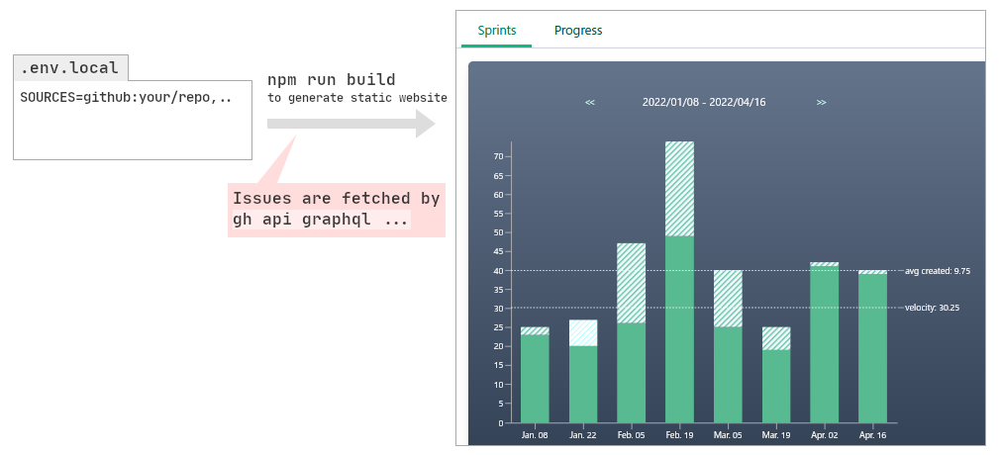

<p align="center">

</p>

Static site generator to visualize project progress. Accepts GitHub issues as a source of project progress.

- [Visualization example](https://yubrot.github.io/storyteller/)
- [Implementation Notes (Japanese)](https://zenn.dev/yubrot/articles/6f8a6d0098900c)

## Usage



1. Copy `.env.example` to `.env.local` and configure it. (See below)
2. Run `npm install && npm run build`.
3. Serve `out/` and open it on your browser.
4. (Cache `.workspace.json` to speed up the next build.)

### Automate with GitHub Actions to deploy to GitHub Pages

```bash
# Add storyteller as a submodule to your project repository
$ git submodule add https://github.com/yubrot/storyteller.git .storyteller

# Prepare environment variables and workspace cache
$ cat << EOM > .storyteller.env
SOURCES=<owner>/<your-repo>
NEXT_PUBLIC_ASSET_PREFIX=/<your-repo>/
EOM
$ echo '{"projects":[]}' > .storyteller.workspace.json

# Initialize workflow (This will deploy the storyteller output to the project gh-pages every Friday)
$ mkdir -p .github/workflows
$ cp .storyteller/.example/storyteller-actions-workflow.yml .github/workflows

$ git add .
$ git commit
$ git push
```

## Configuration

| variable                          | default | description                                                                 |
| --------------------------------- | ------- | --------------------------------------------------------------------------- |
| `SOURCES`                         | -       | A sequence of source locator separated by `,`.                              |
| `NEXT_PUBLIC_RECENT_DAYS`         | `30`    | Range of days highlighted in a darker color on the progress bar.            |
| `NEXT_PUBLIC_SPRINT_DAYS`         | `14`    | Number of days per sprint.                                                  |
| `NEXT_PUBLIC_DEFAULT_STORY_POINT` | `1`     | Default story point for tasks for which no story point has been assigned.   |
| `NEXT_PUBLIC_ASSET_PREFIX`        | `/`     | Asset path prefix. Set to `/<repository>/` if you use project GitHub pages. |

## Available source locator types

Each source locator could have the form `<TYPE>:<QUERY>`. `<TYPE>` defaults to `github` if `<TYPE>:` is omitted.

### `github:<OWNER>/<NAME>[?<OPTIONS>]`

[GitHub CLI](https://github.com/cli/cli#installation) is required.

Treat the GitHub repository `<OWNER>/<NAME>` as a source. Each issue is considered a task, and the label named `sp:<STORY_POINT>` is considered a story point assignment. Closed issues are considered completed tasks.

`<OPTIONS>` consists of a sequence of options separated by `&`. Valid options are:

- `label=<LABEL>`: Only issues labeled with `<LABEL>` will be collected.

### `file:<PATH>`

Treat the JSON file `<PATH>` as a source. The input JSON must satisfy the `ProjectData` type defined in [src/source.ts](./src/source.ts).
